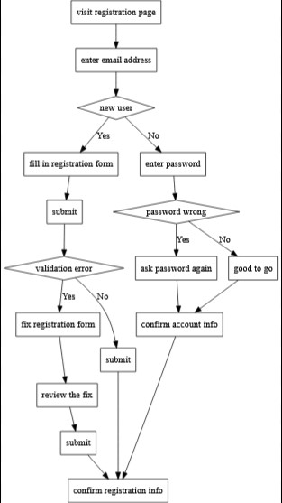
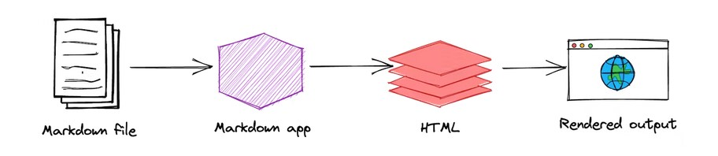

[//]: # (# is used to determine the font size)
[//]: # (To create dashes: --- or <hr>)
[//]: # (`: - backtick)
[//]: # (~: - equivalence)
[//]: # (Markdown is a lightweight markup language that you can use to add formatting elements to plaintext text documents. Created by John Gruber in 2004)
[//]: # (Why Use Markdown?:)
[//]: # (Markdown is portable)
[//]: # (Markdown is platform independent.)
[//]: # (Markdown is future proof.)
[//]: # (Markdown can be used for everything)
[//]: # (Markdown is everywhere.
)

# Heading 1
## Heading 2
### Heading 3
#### Heading 4
##### Heading 5
###### Heading 6

This is a paragraph

---

---

### Ordered list

---
1. Item 1
2. New item
3. Item 3
4. Item 4


### Unordered list

---
- Item one
- Item two
- Item three
- New Item 1
- New Item 2
* Item 5
* Item 6


### Text Formating

---
This text is **bold**

This text is bold

This text is __bold__

This text is *italic*

This text is _italic_

This text is **bold** and *italic*

This is ~~canceled~~

### Task List
---

- [x] Item one
- [] Item two
- [] Item three


### Tables
---

| Number | Name            | Date       |
|--------|-----------------|------------|
| 1      | Kwame Nkrumah   | 08-03-2023 |
| 2      | Yaa Asantewaa   | 08-03-2023 |
| 3      | JB Danquah      | 08-03-2023 |
| 4      | Tetteh Quarshie | 08-03-2023 |

[kenBroTech](https://www.youtube.com/kenbrotech)

### Image

---





### Blockquote

---
> This is a blockquote
> 
> This is another blockquote

### Code

---
This is a code:`print("Hello World")`

```python
for x in range(10):
    print(x)
```

```javascript
console.log("Hello World")
```


### Fenced Code Block

```
{
  "firstName": "John",
  "lastName": "Smith",
  "age": 25
}
```


